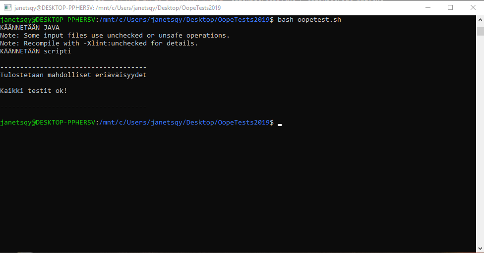

# OopeTests
Tällä bash scriptillä voit testata omaa harjoitustyötäsi.

## Miksi??
Koska kukaan ei jaksa kirjoittaa manuaalisesti kahta eri komentoa eri parametreilla yhden testitiedoston testausta varten tai vertailla tulosteita silmämääräisesti.

# Ohjeita Windows
1. Aseta harjoitustyo hakemistoon (alla ohjeet)
2. Tuplaklikkaa  "simpleTest.bat" tai "extendedTest.bat"
3. Scripti suoriutuu

**Windows vaatimuksia**
* Harjoitustyo samassa kansiossa (jonka sisällä .java lähdekoodi), siten että "harjoitustyo" kansion -juuresta löytyy Oope2HT.java (ja kaikki muut tietysti)
* "iteraattorit" kansio on olemassa.
* Java asennettuna (jdk & jre)
* JAVA-Path asetettu oikein (jos java/javac komennot toimivat jo komentorivillä niin silloin kaikki ok)

# Ohjeita GNU/Linux
1. aseta oma harjoitustyosi kansioon "harjoitustyo" (scripti kääntää koodin automaattisesti)
2. "bash run.sh"
3. ????
4. profit 

**GNU/Linux vaatimuksia**
* repot pävitettynä (sudo apt update)
* Git (sudo apt install git)
* Java (sudo apt-get install openjdk-8-jdk -y)
* Harjoitustyo samassa kansiossa (jonka sisällä .java lähdekoodi)
* "iteraattorit" kansio on olemassa.

# Troubleshoot
Mikäli scripti ei tahdo toimia, kokeile käynnistää itse harjoitustyösi manuaalisesti:
(java harjoitustyo.Oope2HT), jos tämä toimii -> niin scriptikin toimii.

# Esimerkkitulostus: 

